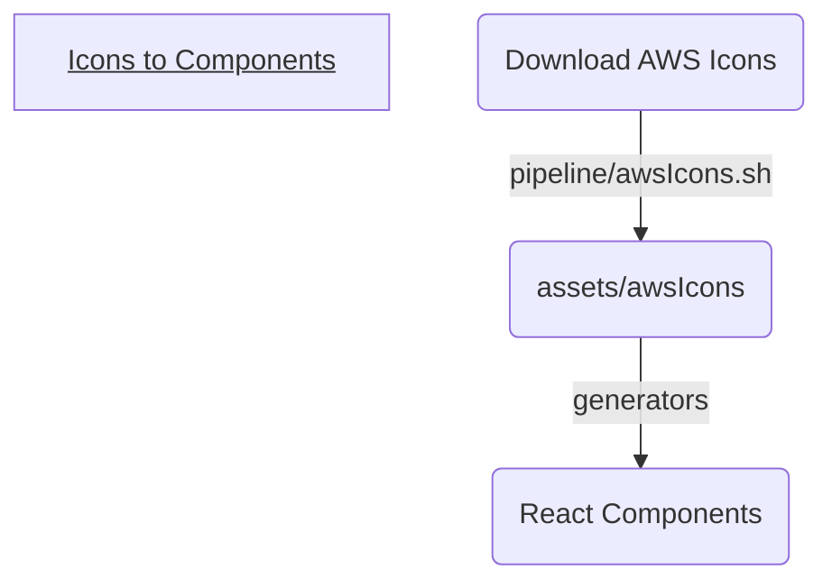

# AWS Game Plan

A free and simple diagramming tool for AWS that doesn't suck.

## Getting started

 1. `npm run husky init`
 2. `npm run generate`
 3. `npm start`

## Architecture

## TODO

-   [x] Saving and reloading flows.
    -   [x] Query params
-   [ ] Bugfixes
    -   [x] Can't delete node if it's not selectable
        -   ~~`onDragStart -> select node, onDragEnd -> de-select node??`~~
        -   Just add a delete button
    - [ ] Overlapping groups 
-   [x] Housekeeping
    -   [x] Formatting (Husky)
    -   [x] Fix small scroll
-   [x] Better CSS
-   [ ] Docs
    -   [x] Mermaid
    -   [ ] Gif showing features (not yet)
- [ ] favicon
    <!--Completes MVP-->
-   [ ] PWA (mobile friendly)
-   [ ] Supabase setup.
    -   [ ] Optional login and save
    -   [ ] Undo & redo buttons with history saved
- [ ] Walkthrough
-   [ ] Self-host
    -   [ ] GraphQL & REST API via Docker.
    -   [ ] AWS architecture diagram to host.
    -   [ ] Terraform to create infrastructure on AWS.

## Thoughts
