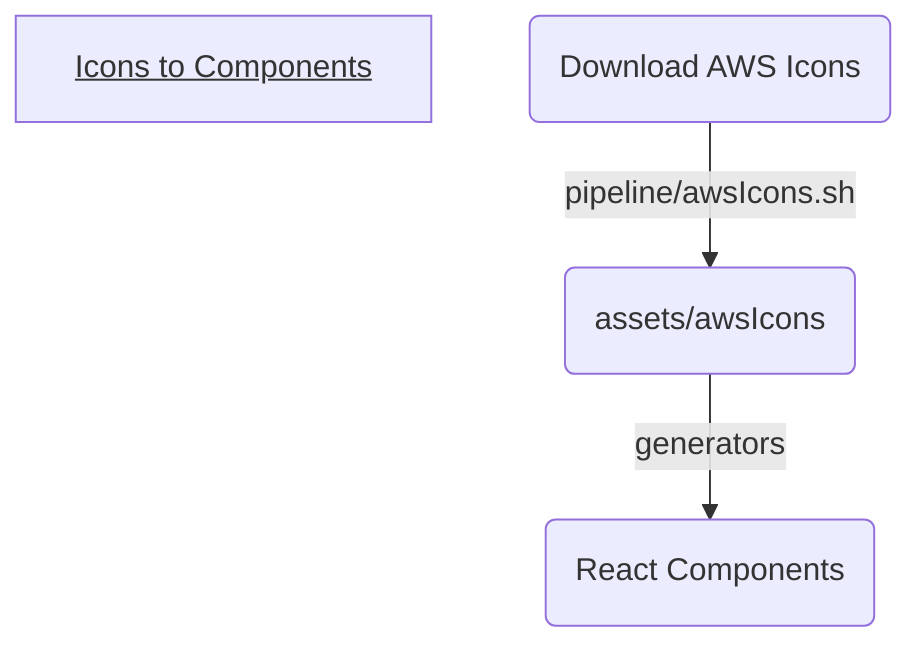

# AWS Game Plan

A free and simple diagramming tool for AWS that doesn't suck.

## Getting started

1.  `npm run husky init` -- setup git hooks
2.  `npm run generate` -- generate code from aws icons
3.  `npm start` -- start the local server

## Features

-   The state of each diagram is automatically saved in the url of the page.
    **Any diagram you make can be easily shared simply by copy-pasting the url.**

## Architecture

Icons are initial taken from the official set provided by Amazon
(https://aws.amazon.com/architecture/icons/). These icons are cleaned
and organized via a bash script, before an auto-generator creates
a React Components for each Service and Group icon.

## Shout Outs

-   Emoji: https://emojipedia.org/
-   Icons: https://www.svgrepo.com/
-   Loading SVG: https://www.svgbackgrounds.com/elements/animated-svg-preloaders/
